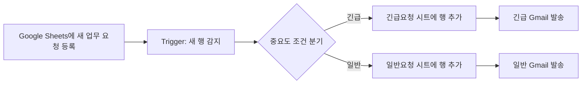

[프로젝트1_자동화도구_비교분석보고서.md](https://github.com/user-attachments/files/30857116/1_._.md)

# 프로젝트 1 — Make와 Zapier 자동화 도구 비교 구현

> **주제:** 업무 요청 중요도 자동 분류 및 이메일 알림  
> **사용 도구:** Make, Zapier, Google Sheets, Gmail  
> **작성 기준일:** 2026년 8월 8일  
> **구현 결과:** 긴급·일반 분기 모두 실제 실행 및 결과 확인 완료

---

## 1. 프로젝트 개요

### 1.1 자동화 대상 업무

Google Sheets에 업무 요청이 등록되면 담당자가 중요도를 확인하고, 긴급 요청과 일반 요청을 별도로 분류한 뒤 이메일로 알림을 보내는 반복 업무를 자동화하였다.

### 1.2 자동화 목적

- 새 업무 요청을 빠짐없이 감지한다.
- 요청의 중요도에 따라 긴급·일반 경로로 자동 분류한다.
- 분류 결과를 각각의 Google Sheets 탭에 기록한다.
- 담당자에게 Gmail 알림을 자동 발송한다.
- 같은 워크플로우를 Make와 Zapier에 각각 구현하여 실제 사용 경험을 바탕으로 두 도구를 비교한다.

### 1.3 핵심 워크플로우

두 도구에서 사용한 앱, 입력 데이터, 분기 조건 및 실행 결과를 동일하게 맞추어 비교의 공정성을 확보하였다.

---

## 2. 요구사항 충족 여부

| 과제 요구사항 | 구현 내용 | 충족 여부 |
|---|---|:---:|
| 서로 다른 자동화 도구 2개 이상 | Make와 Zapier 사용 | ✅ |
| 동일한 워크플로우 구조 | 새 행 감지 → 긴급/일반 분기 → 시트 기록 → Gmail 발송 | ✅ |
| Trigger 1개 이상 | Google Sheets의 새 행 감지 | ✅ |
| Action 2개 이상 | Google Sheets 행 추가, Gmail 발송 | ✅ |
| Filter/Router 1개 이상 | Make의 Router·Filter, Zapier의 Paths·Path rules | ✅ |
| 각 분기 경로 1회 이상 실행 | 긴급 및 일반 테스트 데이터를 각각 실행 | ✅ |
| 실제 동작하는 워크플로우 | 분류 시트 기록과 이메일 수신 결과 확인 | ✅ |
| 도구별 구성·실행 화면 | Make와 Zapier 구성 및 실행 캡처 확보 | ✅ |
| 비교 항목 5개 이상 | 총 8개 항목 비교 | ✅ |
| 장단점과 적합한 상황 제시 | 본 보고서 8~9장에서 정리 | ✅ |

---

## 3. 입력 데이터와 테스트 설계

원본 Google Sheets의 `업무요청` 탭은 다음 세 개 열로 구성하였다.

| 열 | 의미 | 예시 |
|---|---|---|
| 이름 | 요청자 이름 | 홍길동 |
| 요청내용 | 처리할 업무 내용 | 긴급 서버 점검 요청 |
| 중요도 | 조건 분기 기준 | 긴급 또는 일반 |

두 분기가 모두 실제로 실행되는지 확인하기 위해 다음과 같이 테스트하였다.

| 테스트 | 입력 예시 | 기대 경로 | 기대 결과 |
|---|---|---|---|
| 긴급 요청 | 홍길동 / 긴급 서버 점검 요청 / 긴급 | 긴급 경로 | 긴급요청 시트 기록 + 긴급 Gmail 발송 |
| 일반 요청 | 이영희 / 다음 회의자료 준비 요청 / 일반 | 일반 경로 | 일반요청 시트 기록 + 일반 Gmail 발송 |

실행 후 긴급 데이터는 `긴급요청` 탭에, 일반 데이터는 `일반요청` 탭에 각각 기록되었다. Gmail 받은편지함에서도 `[긴급 업무 요청]`과 `[일반 업무 요청]` 메일이 각각 도착한 것을 확인하였다.

---

## 4. Make 구현

### 4.1 구성 요소

| 구분 | Make 모듈·기능 | 역할 |
|---|---|---|
| Trigger | Google Sheets — `Watch New Rows` | `업무요청` 탭에 새 행이 추가되면 시나리오 시작 |
| 분기 | Router | 하나의 입력 흐름을 긴급·일반 두 경로로 분리 |
| Filter 1 | `중요도 = 긴급` | 긴급 데이터만 긴급 경로로 통과 |
| Filter 2 | `중요도 = 일반` | 일반 데이터만 일반 경로로 통과 |
| Action 1 | Google Sheets — `Add a Row` | 해당 분류 탭에 이름·요청내용·중요도를 기록 |
| Action 2 | Gmail — `Send an Email` | 분류에 맞는 제목과 내용으로 알림 발송 |

### 4.2 구현 과정 요약

1. Google 계정을 Make에 연결하고 `프로젝트1_업무요청` 스프레드시트를 지정하였다.
2. `Watch New Rows`를 Trigger로 설정하고 원본 `업무요청` 탭을 감시하도록 구성하였다.
3. Router를 추가하여 긴급·일반 두 경로를 만들었다.
4. 각 경로에 `중요도 = 긴급`, `중요도 = 일반` Filter를 설정하였다.
5. 긴급 경로는 `긴급요청`, 일반 경로는 `일반요청` 탭으로 데이터를 보내도록 `Add a Row`를 설정하였다.
6. 원본 행의 `이름`, `요청내용`, `중요도`를 각 Action의 입력 필드에 매핑하였다.
7. 각 경로 마지막에 Gmail을 연결해 긴급·일반 알림 메일을 발송하도록 설정하였다.
8. `Run once`로 긴급·일반 데이터를 실행하여 두 분기가 각각 정상 작동하는지 확인하였다.

### 4.3 실행 결과

긴급과 일반 데이터를 함께 입력한 실행에서 두 Filter가 각 데이터에 맞는 경로를 선택했고, 양쪽의 Google Sheets 및 Gmail 모듈이 모두 성공하였다. 분류 탭과 받은편지함을 확인하여 최종 결과까지 검증하였다.

> **캡처 자료 1:** Make 전체 Scenario 구성 화면
> 
 
> **캡처 자료 2:** 긴급요청·일반요청 Google Sheets 결과
> 
> 

> **캡처 자료 3:** Make에서 발송된 긴급·일반 Gmail 결과
> 

> 

---

## 5. Zapier 구현

### 5.1 구성 요소

| 구분 | Zapier 단계·기능 | 역할 |
|---|---|---|
| Trigger | Google Sheets — `New Spreadsheet Row` | `업무요청` 탭에 새 행이 추가되면 Zap 시작 |
| 분기 | Paths by Zapier | 긴급·일반 두 Path 생성 |
| Path rule 1 | `중요도 Exactly matches 긴급` | 긴급 데이터만 긴급 Path로 전달 |
| Path rule 2 | `중요도 Exactly matches 일반` | 일반 데이터만 일반 Path로 전달 |
| Action 1 | Google Sheets — `Create Spreadsheet Row` | 해당 분류 탭에 원본 데이터를 기록 |
| Action 2 | Gmail — `Send Email` | 중요도에 맞는 이메일 발송 |

### 5.2 구현 과정 요약

1. Google Sheets의 `New Spreadsheet Row`를 Trigger로 선택하였다.
2. Google 계정을 연결한 후 `프로젝트1_업무요청` 파일과 `업무요청` 탭을 지정하였다.
3. Trigger 테스트로 기존 행을 불러와 필드 구조와 값을 확인하였다.
4. Paths를 추가하고 Path A를 `긴급 요청`, Path B를 `일반 요청`으로 구성하였다.
5. 두 Path에 각각 `중요도 = 긴급`, `중요도 = 일반` 조건을 지정하였다.
6. 각 Path에 Google Sheets 행 생성 Action을 추가하고 `이름`, `요청내용`, `중요도`를 Trigger 데이터와 매핑하였다.
7. 각 Path에 Gmail Action을 추가해 긴급·일반 제목과 본문을 구성하였다.
8. Zap을 Publish한 뒤 원본 시트에 새로운 긴급·일반 행을 추가하여 실제 자동 실행을 확인하였다.

### 5.3 실행 결과

Publish된 Zap에서 홍길동의 긴급 요청은 긴급 Path를 통해 처리되었고, 이영희의 일반 요청은 일반 Path를 통해 처리되었다. 각각 해당 Google Sheets 탭에 기록되었으며, 받은편지함에는 다음과 같은 이메일이 도착하였다.

- `[긴급 업무 요청] 새로운 요청이 등록되었습니다.` — 홍길동 / 긴급 서버 점검 요청 / 긴급
- `[일반 업무 요청] 새로운 요청이 등록되었습니다.` — 이영희 / 다음 회의자료 준비 요청 / 일반

> **캡처 자료 4:** Zapier 전체 Zap 구성 화면
> 
> 

> **캡처 자료 5:** Zapier 실행 후 긴급요청·일반요청 시트 결과
> 
> 

> **캡처 자료 6:** 긴급·일반 메일이 함께 보이는 받은편지함
> 

> **캡처 자료 7:** Zapier에서 발송된 긴급 메일 상세 화면
> 
> 

> **캡처 자료 8:** Zapier에서 발송된 일반 메일 상세 화면
> 

---

## 6. 구현 중 발생한 문제와 해결

### 6.1 Make

| 문제 | 원인 | 해결 방법 | 배운 점 |
|---|---|---|---|
| `Connection/Drive: Value must not be empty` | Google Sheets 모듈의 필수 연결값 누락 | 각 모듈에서 Google 연결과 `My Drive`를 다시 지정 | 모듈마다 필수 연결값이 저장되었는지 확인해야 한다. |
| `Body type: Value must not be empty` | Gmail 본문 형식을 선택하지 않음 | `Plain text` 또는 `Raw HTML` 지정 | Action은 보이는 데이터뿐 아니라 필수 옵션도 모두 필요하다. |
| `Unable to parse range` | Trigger가 실제 탭 이름과 다른 `시트1` 범위를 참조 | 원본 탭을 다시 선택하고 헤더 범위를 `A1:C1`로 확인 | 파일명과 시트 탭 이름은 서로 다른 값이며 정확히 일치해야 한다. |
| 분기가 통과되지 않음 | Filter의 비교값과 실제 중요도 데이터가 일치하지 않음 | 실제 셀 값과 `긴급`·`일반` 조건을 다시 확인 | 조건은 철자와 공백까지 실제 데이터와 일치해야 한다. |

### 6.2 Zapier

| 문제 | 원인 | 해결 방법 | 배운 점 |
|---|---|---|---|
| `Your path would not have continued` 경고 | 긴급 Path를 테스트하면서 중요도가 `일반`인 샘플 레코드를 사용 | Trigger에서 `긴급` 레코드를 새로 선택해 Path 재테스트 | Path 테스트 결과는 워크플로우 오류뿐 아니라 선택한 샘플 데이터의 영향을 받는다. |
| 긴급 제목의 이메일에 일반 내용이 표시 | 긴급 Gmail Action을 일반 샘플 데이터로 개별 테스트 | 긴급 샘플 레코드로 교체한 뒤 다시 테스트 | 개별 Action 테스트와 전체 Path 실행 테스트를 구분해야 한다. |
| 반복 실행 가능성 경고 | Trigger와 Action이 같은 스프레드시트 파일을 사용 | Trigger는 `업무요청`, Action은 `긴급요청`·`일반요청` 탭으로 분리 | 입력 대상과 출력 대상을 분리하면 반복 실행 위험을 줄일 수 있다. |

오류를 해결하는 과정에서 단순히 메시지를 무시하지 않고, 입력 데이터·필수 설정·시트 범위·샘플 레코드를 단계별로 확인하는 것이 자동화 디버깅의 핵심임을 알게 되었다.

---

## 7. Make와 Zapier 비교 분석

아래의 사용성 평가는 이번 프로젝트를 직접 구현한 경험을 기준으로 하며, 플랜·연동 범위 등 객관적 정보는 2026년 8월 8일 기준 공식 자료를 확인하였다.

| 비교 항목 | Make | Zapier | 이번 프로젝트에서의 판단 |
|---|---|---|---|
| 1. UI/UX | 모듈과 연결선, Router의 두 갈래 흐름이 하나의 캔버스에 표시됨 | Zap outline과 Paths를 통해 전체 단계를 시각적으로 확인 가능 | 두 도구 모두 시각적이지만 Make가 전체 분기 관계를 더 빠르게 파악하기 쉬웠다. |
| 2. 초기 설정 난이도 | 처음 보는 용어와 필드 매핑은 낯설었지만 화면 구성이 비교적 직관적이었음 | 입력해야 할 설정 창과 단계가 더 많게 느껴졌고 샘플 레코드 선택도 이해가 필요했음 | 초보자인 작성자에게는 Make가 더 쉬웠다. |
| 3. 조건 분기 방식 | Router로 경로를 만든 뒤 각 연결선에 Filter를 설정 | Paths 안에 각 Path rule을 설정 | Make는 분기가 가로로 펼쳐져 비교가 쉬웠고, Zapier는 Path별 설정을 차례로 열어 확인해야 했다. |
| 4. 데이터 매핑 | 이전 모듈의 출력 토큰을 다음 모듈 필드에 연결 | Trigger 레코드의 필드를 각 Action 입력란에 연결 | 원리는 같았다. Zapier는 현재 선택된 테스트 레코드가 Action 테스트 결과에 직접 나타나므로 샘플 선택에 더 주의해야 했다. |
| 5. 테스트 편의성 | `Run once` 실행 후 캔버스에서 통과한 경로와 모듈별 처리 건수를 바로 확인 | 단계별 `Test step`과 Publish 후 전체 실행을 구분하여 확인 | 작성자는 Make의 테스트 과정이 더 매끄럽고 이해하기 쉬웠다고 평가했다. |
| 6. 오류·실행 로그 | 실행 모듈에서 오류 위치를 바로 확인할 수 있고, Scenario History에서 상태·실행시간·크레딧·번들과 로그를 확인 가능 | Zap History와 편집기에서 실행 상태 및 단계별 Data In/Out, 오류 로그를 확인 가능 | 두 도구 모두 상세 로그를 제공하지만 이번 실습에서는 Make가 실수 위치를 찾기 쉬웠다. ([Make 공식 도움말](https://help.make.com/scenario-history), [Zapier 공식 도움말](https://help.zapier.com/hc/en-us/articles/8496291148685-View-and-manage-your-Zap-history)) |
| 7. 연동 서비스 범위 | 공식 요금 페이지에서 3,000개 이상의 앱을 안내 | 공식 연동 페이지에서 9,000개 이상의 앱을 안내 | 수치상 Zapier가 더 넓다. 다만 실제 선택에서는 필요한 앱의 Trigger·Action 제공 여부를 개별 확인해야 한다. ([Make 공식 요금 페이지](https://www.make.com/en/pricing), [Zapier 공식 연동 페이지](https://zapier.com/apps/connect/integrations)) |
| 8. 무료 플랜과 비용 | 무료: 월 1,000크레딧, 활성 Scenario 최대 2개, Router·Filter 포함, 예약 실행 최소 간격 15분 | 무료: 월 100 tasks, Zap 수는 무제한이나 각 Zap은 Trigger 1개 + Action 1개의 2단계만 지원. Paths는 Professional 이상 | 이번과 같은 다중 Action·양방향 분기는 Make 무료 플랜에서도 가능하지만, Zapier에서는 Pro 체험판 또는 유료 플랜이 필요하다. ([Make 공식 요금 페이지](https://www.make.com/en/pricing), [Zapier 공식 요금 페이지](https://zapier.com/pricing), [Paths 공식 도움말](https://help.zapier.com/hc/en-us/articles/8496288555917-Add-branching-logic-to-Zap-workflows-with-Paths)) |

### 7.1 무료 플랜 해석 시 주의점

- Make는 대부분의 일반 모듈 실행을 크레딧으로 계산하며, 무료 플랜은 월 1,000크레딧을 제공한다. 공식 요금 페이지에 따르면 Router는 크레딧을 소비하지 않는다.
- Zapier 무료 플랜은 월 100 tasks를 제공하지만 2단계 Zap만 만들 수 있다. 이번 프로젝트처럼 하나의 Trigger 뒤에 Paths와 두 개의 Action을 연결한 구조는 무료 플랜 범위를 넘는다.
- 본 프로젝트의 Zapier 구현 화면에는 14일 Pro 체험판 안내가 표시되었으며, Paths와 Multi-step Zap을 체험판 기능으로 사용해 구현하였다. 체험 기간 종료 후 같은 Zap을 계속 운영하려면 해당 기능을 지원하는 유료 플랜이 필요하다.
- Zapier 공식 도움말에 따르면 Paths와 Filter 단계 자체는 task 사용량에 포함되지 않지만, 실행된 경로 안의 앱 Action은 task를 사용할 수 있다.
- 가격과 기능은 변경될 수 있으므로 실제 도입 시 공식 요금 페이지를 다시 확인해야 한다.

---

## 8. 도구별 장단점

### 8.1 Make

**장점**

- 전체 워크플로우와 조건 분기를 한 캔버스에서 확인하기 쉽다.
- Router와 Filter가 무료 플랜에 포함되어 이번과 같은 분기 자동화를 비용 없이 학습하기 좋다.
- `Run once`에서 데이터가 지나간 경로와 처리 결과를 직관적으로 확인할 수 있었다.
- 설정 실수나 오류가 발생한 모듈의 위치를 비교적 빠르게 찾을 수 있었다.

**단점**

- Scenario, Module, Router, Filter, Bundle, Mapping 등 처음 접하는 용어를 익혀야 한다.
- Connection, Drive, 시트 범위와 같은 필수값을 빠뜨리면 실행 전에 여러 오류가 발생할 수 있다.
- 복잡한 Scenario에서는 모듈과 연결선이 많아져 캔버스가 복잡해질 가능성이 있다.

### 8.2 Zapier

**장점**

- Trigger와 Action을 순서대로 설정하는 구조가 명확하다.
- Paths를 사용하면 하나의 Zap 안에서 여러 결과를 처리할 수 있다.
- 공식 안내 기준 9,000개 이상의 앱을 지원하여 연동 선택지가 넓다.
- Zap History에서 실행 상태와 단계별 입출력 데이터를 확인할 수 있다.

**단점**

- 이번 프로젝트에서는 Make보다 입력·설정 화면이 많고 초보자에게 다소 복잡하게 느껴졌다.
- 단계별 테스트가 현재 선택된 샘플 레코드를 사용하므로, 조건과 맞지 않는 레코드를 선택하면 결과를 오해하기 쉽다.
- 이번 프로젝트에 필요한 Paths와 Multi-step Zap은 무료 플랜에서 사용할 수 없어 장기 운영 시 비용을 고려해야 한다.

---

## 9. 어떤 상황에서 적합한가

### Make가 적합한 상황

- 조건 분기와 여러 처리 경로를 한눈에 보며 설계하고 싶은 경우
- 무료 플랜에서 Router와 Filter를 사용해 다단계 자동화를 학습하려는 경우
- 실행 중 어느 모듈에서 오류가 발생했는지 시각적으로 빠르게 확인하고 싶은 경우
- 데이터 처리 흐름과 매핑 과정을 세밀하게 구성하려는 경우

### Zapier가 적합한 상황

- 필요한 서비스가 Zapier의 폭넓은 앱 생태계에 포함되어 있는 경우
- Trigger부터 Action까지 순차적인 목록 구조를 선호하는 경우
- 유료 플랜 사용이 가능하고 Paths, Multi-step Zap, Premium app 등이 필요한 경우
- Zap History와 단계별 Data In/Out을 활용해 운영 기록을 관리하려는 경우

### 이번 프로젝트의 최종 선택

이번 실습에서는 **Make가 더 적합하다고 판단하였다.** 처음 사용하는 도구였지만 워크플로우를 한 화면에서 파악하기 쉬웠고, 테스트 실행과 오류 위치 확인이 Zapier보다 매끄럽게 느껴졌기 때문이다. 또한 이번에 사용한 Router와 Filter가 무료 플랜에 포함되어 있어 학습 및 소규모 자동화에 대한 비용 부담도 더 낮다.

다만 이것이 모든 업무에서 Make가 항상 우수하다는 의미는 아니다. 필요한 앱의 지원 여부, 예상 실행량, 협업 기능, 운영 예산을 함께 비교한 후 업무별로 선택해야 한다.

---

## 10. 학습 목표 정리

### 10.1 Trigger와 Action의 개념

**Trigger**는 자동화를 시작시키는 사건이다. 이번 프로젝트에서는 Google Sheets의 `업무요청` 탭에 새로운 행이 추가되는 것이 Trigger였다.

**Action**은 Trigger 발생 후 자동으로 실행되는 처리 동작이다. 이번 프로젝트에서는 분류된 데이터를 다른 Google Sheets 탭에 추가하고 Gmail을 발송하는 작업이 Action이었다.

### 10.2 Filter와 Router·Paths의 역할

**Router 또는 Paths**는 하나의 입력 흐름을 여러 처리 경로로 나눈다. Make에서는 Router를, Zapier에서는 Paths를 사용하였다.

**Filter 또는 Path rule**은 각 경로를 통과할 수 있는 조건을 판단한다. 이번 프로젝트에서는 `중요도 = 긴급`과 `중요도 = 일반`을 조건으로 사용하였다.

즉, Router·Paths가 길을 만들고 Filter·Path rule이 각 길의 통과 기준을 정한다.

### 10.3 서로 다른 자동화 도구의 특징 비교

Make는 캔버스 기반의 시각적 설계와 무료 Router·Filter가 강점이었으며, Zapier는 폭넓은 앱 연동과 순차적인 편집 구조가 강점이었다. 직접 같은 워크플로우를 구현하면서 두 도구의 UI, 테스트, 분기 설정, 오류 확인 및 플랜 차이를 비교할 수 있었다.

### 10.4 특정 업무에 적합한 도구를 선택하는 방법

도구는 단순히 익숙함만으로 선택하지 않고 다음 순서로 판단해야 한다.

1. 자동화할 반복 업무와 필요한 Trigger·Action을 정의한다.
2. 조건 분기, 실행 주기, 오류 처리 등 필요한 기능을 정한다.
3. 각 도구가 필요한 앱과 기능을 지원하는지 확인한다.
4. 예상 실행량과 무료·유료 플랜 비용을 비교한다.
5. 직접 작은 테스트를 구현해 UI, 로그 및 유지관리 편의성을 평가한다.

이번 업무에서는 두 갈래 분기와 다중 Action이 필요했으므로 무료 기능 범위와 시각적 분기 편의성을 근거로 Make를 더 적합한 도구로 판단하였다.

### 10.5 자동화 흐름의 단계별 설명

> Google Sheets에 새로운 업무 요청 행이 추가되면 자동화가 시작된다. Trigger가 이름, 요청내용, 중요도를 읽고 Router 또는 Paths로 전달한다. 조건 분기 기능은 중요도가 긴급인지 일반인지 판단하여 알맞은 경로만 실행한다. 이후 해당 분류의 Google Sheets 탭에 행을 추가하고, 담당자에게 긴급 또는 일반 Gmail 알림을 보낸다.

---

## 11. 결론

본 프로젝트에서는 동일한 업무 요청 분류 자동화를 Make와 Zapier에 각각 구현하였다. 두 도구 모두 `새 행 감지 → 중요도 분기 → 분류 시트 기록 → 이메일 알림` 흐름을 정상적으로 수행했으며, 긴급·일반 경로를 각각 실제 실행하여 결과를 확인하였다.

처음에는 계정 연결, 필수 입력값, 시트 범위, 데이터 매핑 및 테스트 레코드 선택에서 오류와 혼란이 있었지만, 각 단계의 입력과 출력 데이터를 확인하며 해결하였다. 이를 통해 자동화는 단순히 모듈을 연결하는 작업이 아니라 **Trigger의 데이터가 조건을 거쳐 어떤 Action으로 전달되는지 이해하고, 실패 시 어느 단계에서 문제가 생겼는지 추적하는 과정**임을 학습하였다.

직접 사용한 결과 Make는 시각적 분기 구조, 테스트 편의성 및 오류 확인 측면에서 더 사용하기 편했으며, 무료 플랜에서도 이번 프로젝트의 핵심 분기 기능을 사용할 수 있다는 장점이 있었다. Zapier는 연동 앱 범위가 넓지만, 이번 구성에 필요한 Paths와 Multi-step 기능은 유료 플랜 또는 체험판이 필요했다. 따라서 이번 업무에는 Make가 더 적합하다는 결론을 내렸다.

---

## 12. 제출 캡처 목록

아래 캡처는 보고서와 함께 별도 파일로 제출한다. 계정 이메일이나 개인 정보가 보이면 일부를 마스킹한다.

| 권장 파일명 | 내용 |
|---|---|
| `01_make_workflow.png` | Make 전체 Scenario |
| `02_make_run_result.png` | 긴급·일반 분기 실행 성공 |
| `03_make_sheets_result.png` | Make 실행 후 분류 시트 |
| `04_make_gmail_result.png` | Make 실행 후 Gmail |
| `05_zapier_workflow.png` | Zapier 전체 Zap과 두 Paths |
| `06_zapier_publish.png` | Zap Publish 성공 및 체험판 안내 |
| `07_zapier_sheets_result.png` | Zapier 실행 후 분류 시트 |
| `08_zapier_gmail_inbox.png` | 긴급·일반 메일 도착 목록 |
| `09_zapier_urgent_email.png` | 긴급 메일 상세 |
| `10_zapier_normal_email.png` | 일반 메일 상세 |

---

## 13. 참고 자료

모든 플랜·기능 정보는 2026년 8월 8일에 확인하였다.

- [Make 공식 요금 및 플랜](https://www.make.com/en/pricing)
- [Make Scenario History 공식 도움말](https://help.make.com/scenario-history)
- [Zapier 공식 요금 및 플랜](https://zapier.com/pricing)
- [Zapier Paths 공식 도움말](https://help.zapier.com/hc/en-us/articles/8496288555917-Add-branching-logic-to-Zap-workflows-with-Paths)
- [Zapier Task 사용 기준](https://zapier.com/pricing/rates)
- [Zapier 연동 앱 공식 페이지](https://zapier.com/apps/connect/integrations)
- [Zapier History 공식 도움말](https://help.zapier.com/hc/en-us/articles/8496291148685-View-and-manage-your-Zap-history)

